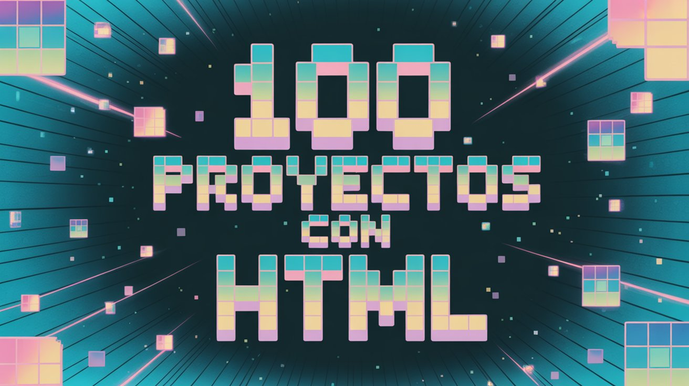

# 🧱🌐 **HTML100 – Colección de Documentos y Maquetaciones** 📄✨

🌟 **Bienvenido a mi colección de proyectos HTML puros** 🌟  
Aquí encontrarás **100 ejemplos y maquetaciones simples**, enfocados en **estructura semántica**, **accesibilidad** y **buenas prácticas** en la creación de páginas web sin CSS ni JavaScript.  

> 💡 **Objetivo:** Dominar las bases de HTML a través de ejercicios prácticos y variados que consoliden la estructura y el marcado semántico.

---

## 🔥 **¿QUÉ ENCONTRARÁS EN ESTE REPOSITORIO?**  

✅ **Estructuras HTML semánticas** 🏷️ – Uso correcto de etiquetas y jerarquías.  
✅ **Ejemplos de formularios y tablas** 📋 – Campos, validaciones y datos bien presentados.  
✅ **Contenido multimedia** 🎥 – Imágenes, audio, video e iframes.  
✅ **Prácticas de accesibilidad web** ♿ – Etiquetas alt, roles ARIA y jerarquía de títulos.  
✅ **Elementos interactivos nativos** 🔍 – Details, summary, inputs avanzados.  

🎯 **Este repositorio está diseñado para sentar bases sólidas**, antes de pasar a CSS y JavaScript.

---

## 🛠️ **CONCEPTOS Y ETIQUETAS UTILIZADOS**  

💻 **HTML5** – Estructura moderna y estándar.  
🧱 **Etiquetas semánticas** – `<header>`, `<main>`, `<article>`, `<section>`, `<footer>`.  
📄 **Formularios completos** – Inputs, selects, textareas, fieldsets y datalists.  
📊 **Tablas con accesibilidad** – Scope, caption, colgroup y encabezados.  
🎭 **Multimedia nativa** – `<audio>`, `<video>`, `<picture>`, `<iframe>`.  
🌍 **SEO básico** – Meta etiquetas, open graph y atributos hreflang.  

> 🏆 **Enfoque en código limpio, validado y listo para escalar con estilos y scripts.**

---

## 🚀 **OBJETIVO DE ESTE REPOSITORIO**  

> 💡 **HTML100 es un punto de partida sólido** para construir proyectos web completos.  
Cada documento sirve como ejemplo práctico para **comprender, recordar y aplicar** las etiquetas y estructuras que componen la base de toda página web.

---
